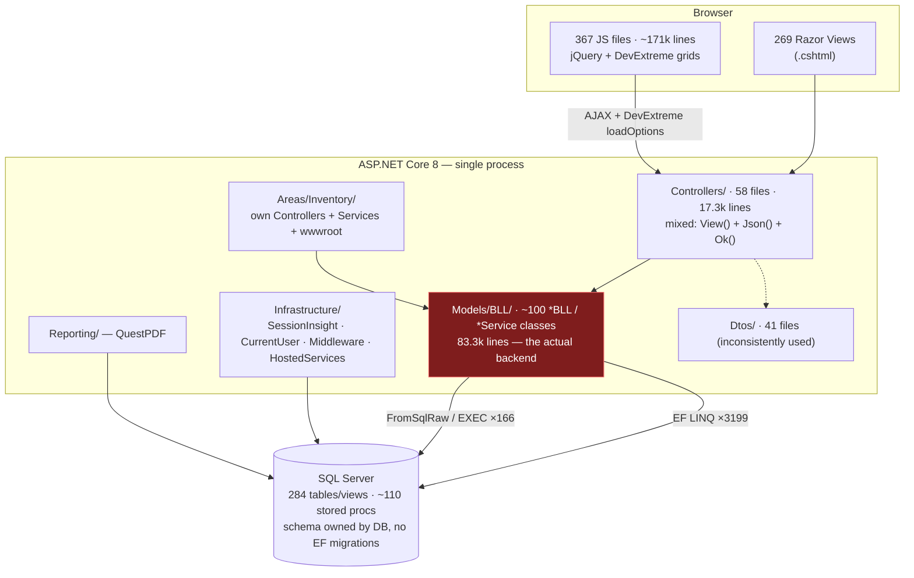
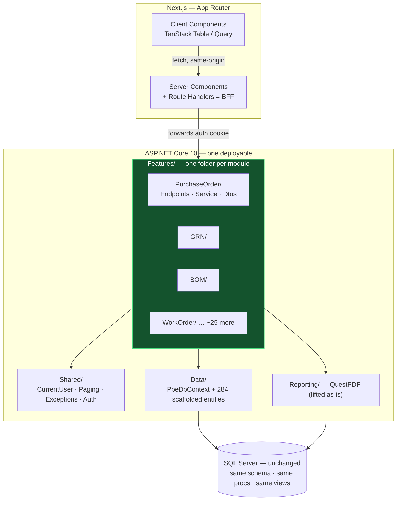
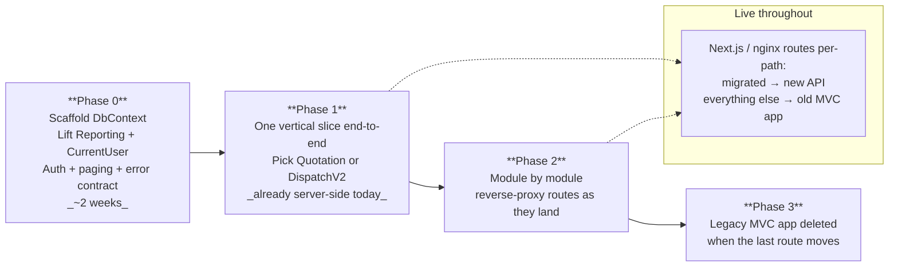

# PPE ERP — Backend Architecture & Rewrite Options

> Decision doc for: *"introduce a Next.js frontend and make the backend clean."*
> Measured against the repo on **2026-08-10** (branch `Master`, commit `4a8d94b9`).

---

## 1. What exists today

A single ASP.NET Core 8 MVC monolith. Razor views + jQuery/DevExtreme on the front,
EF Core (database-first) against one SQL Server on the back.

### Measured size

| Layer | Count | Notes |
|---|---|---|
| C# source | **~110,000 lines** | 380 files |
| `Controllers/` | 58 controllers, 17.3k lines | only **3** carry `[ApiController]` |
| `Models/` (entities + BLL) | 252 files, **83.3k lines** | the real backend; `BomBLL.cs` alone is **10,444 lines** |
| Razor views | 269 `.cshtml` | |
| Client JS | **~171,000 lines**, 367 files | jQuery + DevExtreme widgets |
| DI registrations | **~110 hand-written `AddScoped`** | [`Program.cs:58-174`](Program.cs#L58-L174) |
| `DbSet<>` in context | **284** (52 of them SQL views) | [`Models/Database/PPE_DBcontext.cs`](Models/Database/PPE_DBcontext.cs) |
| EF LINQ call sites | **~3,199** | the logic lives here |
| Raw SQL call sites | **~166** | ~110 `EXEC <proc>`, rest `SELECT * FROM Vw_…` |
| EF migrations | **none** | schema is managed in SQL Server, not in code |

### The two numbers that decide everything

1. **`return Json(` 450 + `return Ok(` 462 vs `return View(` 278.**
   ~77% of controller actions already emit JSON. The backend is an API wearing an MVC costume.
2. **3,199 LINQ sites vs 166 raw-SQL sites.**
   The business logic is in C#, not in stored procedures. Any rewrite that leaves .NET
   is a rewrite of 3,199 query sites by hand.

### Current shape



### Where the pain is

- **`Models/BLL/` is a 83k-line drawer**, not a layer. `BomBLL.cs` (10.4k), `PurchaseOrderBLL.cs` (5.6k),
  `WorkOrderBLL.cs` (4.7k). Grouped by technical role, so every feature is smeared across
  `Controllers/` + `Models/BLL/` + `Models/Models/` + `Dtos/`.
- **`Program.cs` is a 300-line registration wall.** Adding a service means editing a shared hot file.
- **`Domain/` contains one 9-line interface.** A layered architecture that was started and abandoned —
  useful evidence about what this codebase actually wants.
- **EF entities leak to the wire.** `Dtos/` exists (41 files) but most of the 450 `Json(` calls bypass it.
  Tolerable with Razor; a real contract problem once a typed TS client consumes it.

---

## 2. The four options

| | Option | Backend stack | Rewrite cost | Verdict |
|---|---|---|---|---|
| **A** | **Fresh .NET, same DB** | ASP.NET Core 10, vertical slices, EF Core scaffolded from the live DB | **Medium** — port C# to C# | ✅ **Recommended if rewriting** |
| **B** | Strangler, no rewrite | Keep this project, rename `BLL`→`Service`, add `/api` | **Low** | ✅ Recommended if *not* rewriting |
| **C** | Node/TypeScript | NestJS + Prisma or Kysely | **High** | ⚠️ One language, but 3,199 queries by hand |
| **D** | Go / Java / Python | Gin · Spring Boot · FastAPI | **Highest** | ❌ Third language on the team, no upside here |

### Option A — fresh .NET solution, same database *(recommended)*

You throw away the 83k lines of accumulated BLL, and you keep everything that was expensive to get right:
the schema, the ~110 stored procs, the 52 SQL views, the QuestPDF report templates, and the team's C#.

**What you get for free on day one:**

```bash
dotnet ef dbcontext scaffold "Name=ConnectionStrings:PPE" \
  Microsoft.EntityFrameworkCore.SqlServer \
  --output-dir Data/Entities --context PpeDbContext --no-onconfiguring
```

That regenerates all 284 entities and the 878-line context from the live database in one command.
The DB is already the source of truth (there are no migrations to reconcile), so this is not a
best-effort import — it is exact.

**What you must port by hand:** the ~3,199 LINQ query sites, module by module. This is the whole job.
No tool does it. Budget it honestly.

### Option C — NestJS, honestly assessed

Real upside: one language across Next.js and the API, one toolchain, easier hiring.

Real costs, specific to this repo:
- 3,199 LINQ sites hand-translated to Prisma/Kysely — the same work as Option A, but in an unfamiliar idiom.
- **`Reporting/` is QuestPDF.** Node has no equivalent of comparable quality. You rewrite every PDF layout
  against Puppeteer or pdfmake and accept worse output.
- `ClosedXML` → `exceljs` is a fair swap; that one's fine.
- Multi-result-set procs ([`DbHelperMultiResult.cs`](Models/Helpers/DbHelperMultiResult.cs), 307 lines) and
  the table-valued params in `DispatchBLL` / `Diverstion` / `GRNBLL` are awkward from the `mssql` driver.
- SQL Server `decimal` ↔ JS `number` is a live correctness hazard in an ERP that computes money.

Pick C only if "one language" is a strategic goal you'll pay for. It is not cheaper.

---

## 3. Target architecture (Option A)



### Folder layout — vertical slices, not layers

```
PPE.Api/
├── Features/
│   ├── PurchaseOrder/
│   │   ├── PurchaseOrderEndpoints.cs   # thin: route → service → DTO
│   │   ├── PurchaseOrderService.cs     # the logic, ~300 lines not 5,583
│   │   ├── PurchaseOrderDtos.cs        # request + response records
│   │   └── PurchaseOrderQueries.cs     # LINQ, split out when the service gets fat
│   ├── GRN/
│   └── BOM/
├── Shared/
│   ├── CurrentUser/          # lifted from Infrastructure/CurrentUser — already good
│   ├── Paging/               # DataSourceLoadOptions — see §5
│   ├── Auth/
│   └── GlobalExceptionHandler.cs
├── Data/
│   ├── PpeDbContext.cs       # scaffolded
│   └── Entities/             # scaffolded, never hand-edited
├── Reporting/                # QuestPDF, copied over unchanged
└── Program.cs                # ~60 lines: Scrutor scans Features/, done
```

One project. Not four. `Domain/` + `Application/` + `Infrastructure/` + `Api/` gives you an
interface per service and three extra `.csproj` files to fight; this repo already tried that and
`Domain/` still holds exactly one 9-line file.

**No MediatR, no CQRS, no repository layer.** `DbContext` *is* the repository — wrapping it in
`IPurchaseOrderRepository` adds a file and removes nothing. Add MediatR the day you have a
cross-cutting behavior worth a pipeline, not before.

### Auth: cookie + BFF, not JWT

Keep `MyCookieAuth` ([`Program.cs:178`](Program.cs#L178)). Next.js route handlers run server-side and
forward the cookie to the API on the same site. HttpOnly stays on, nothing lands in `localStorage`,
no refresh-token rotation to get wrong. Rewriting auth to JWT is weeks of work that buys nothing
when both halves ship behind the same hostname.

---

## 4. Migration path

Rewriting all 25-odd modules before shipping anything is how rewrites die. Run both stacks side by side.



**Start with Quotation, CustomerSupport, or DispatchV2.** Per
[`SERVER_SIDE_RENDERING_AUDIT.md`](SERVER_SIDE_RENDERING_AUDIT.md) those are already fully
server-side, so the slice proves the new stack without also fighting a client-side grid rewrite.

**Leave BOM for last.** 10,444 lines in one file, and every other module touches it.

---

## 5. Reuse, don't reinvent

| Asset | Do |
|---|---|
| DB schema, 284 tables/views, ~110 procs | **Keep unchanged.** Scaffold entities from it. |
| `Reporting/` (QuestPDF, 12 files) | **Copy across as-is.** No dependency on the old BLL. |
| `Infrastructure/CurrentUser/` | **Lift.** Business-unit isolation is already clean and generic. |
| `Infrastructure/SessionInsight/` | **Lift**, drop the Razor views. |
| `Dtos/` (41 files) | **Seed the new DTOs from these**, then enforce: never return an EF entity. |
| `DataSourceLoadOptions` paging | **Keep the query contract.** See below. |
| `Models/BLL/` (83.3k lines) | **Read as spec, then delete.** This is the thing you are rewriting. |
| 171k lines of DevExtreme JS | **Delete as each module migrates.** Nothing survives. |

### Keep the grid query contract, drop the widget

`DevExtreme.AspNet.Data` is **MIT-licensed and server-side only** — the DevExtreme licence covers the
client widgets you're dropping, not this. `DataSourceLoader.Load(query, loadOptions)` already pushes
paging, sorting, filtering, and grouping into SQL, and it's proven on 12 grids.

So have TanStack Table serialise into the `skip/take/sort/filter/group` query format the server already
parses. Inventing a fresh `?page&size&sort` contract means re-plumbing ~180 grids on the *server* too,
on top of rewriting them on the client.

**Corollary for in-flight work:** the server half of the SSR-audit migrations survives the frontend
swap; the JS half is throwaway. Stop doing Category-3 "inert flag" fixes on screens a Next.js rewrite
will own — do them only where the server endpoint doesn't exist yet.

---

## 6. Honest risk note

Option A is a rewrite of ~83k lines of business logic that currently runs a live factory. The schema,
the procs, and the reports carry over; the logic does not. There is no tool for the 3,199 query sites.

Option B (strangler the existing project — rename `BLL`→`Service`, add `[ApiController]` and `/api`
routes, Scrutor the DI wall, enforce DTOs at the boundary) gets you a Next.js frontend and most of the
cleanliness for a fraction of the cost, because **77% of your controller actions already return JSON.**

If the rewrite happens anyway, Option A is the right shape. But B is the cheaper answer to the
question you actually asked, and the two share Phase 0 — so nothing in this doc is wasted if you
start with B and escalate later.
