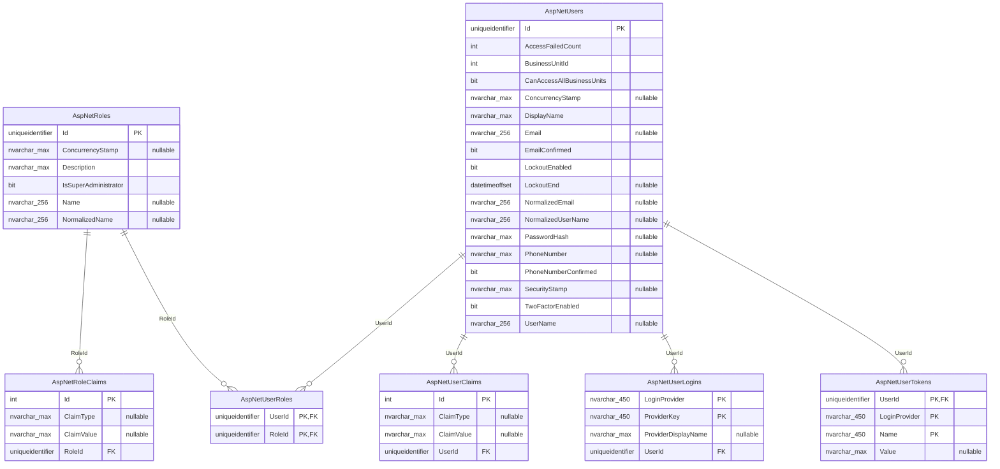

<!-- Generated from the EF Core model by Erp.ArchitectureTests. Do not edit. -->

# Database schema `identity`

7 tables. Regenerate with:

```
dotnet test backend/tests/Erp.ArchitectureTests --filter FullyQualifiedName~SchemaDiagram
```



## Columns that name a relationship the database does not enforce

Found by name (`*Id`, not a primary key, not covered by any foreign key), so the list
is a prompt to look rather than a defect list. Some entries are deliberate: audit
columns and anything pointing into another module's schema cannot be constrained,
because each module owns a separate `DbContext`. See `db/erd/README.md`.

| Table | Column | Type |
|---|---|---|
| AspNetUsers | BusinessUnitId | `int` |
