<!-- Generated from the EF Core model by Erp.ArchitectureTests. Do not edit. -->

# Database schema `masters`

13 tables. Regenerate with:

```
dotnet test backend/tests/Erp.ArchitectureTests --filter FullyQualifiedName~SchemaDiagram
```



```mermaid
erDiagram
    AssemblyNode {
        uniqueidentifier Id PK
        int BusinessUnitId
        nvarchar_30 Code
        datetimeoffset CreatedAtUtc
        uniqueidentifier CreatedByUserId
        datetimeoffset DeletedAtUtc "nullable"
        uniqueidentifier DeletedByUserId "nullable"
        int DisplaySequence "nullable"
        nvarchar_500 DrawingPath "nullable"
        nvarchar_100 DrivenBy "nullable"
        bit IsActive
        bit IsDeleted
        nvarchar_20 Level
        nvarchar_50 MachineType "nullable"
        nvarchar_50 ManualCode "nullable"
        datetimeoffset ModifiedAtUtc "nullable"
        uniqueidentifier ModifiedByUserId "nullable"
        nvarchar_255 Name
        uniqueidentifier ParentId FK "nullable"
        decimal_18_6 Quantity "nullable"
        nvarchar_500 Remark "nullable"
        rowversion RowVersion
        nvarchar_2500 TechnicalSpecification "nullable"
        decimal_18_4 WeightKg "nullable"
    }
    BusinessUnit {
        int Id PK
        nvarchar_500 Address "nullable"
        nvarchar_200 BusinessName "nullable"
        int BusinessUnitId "nullable"
        nvarchar_21 Cin "nullable"
        nvarchar_30 ContactNumber "nullable"
        datetimeoffset CreatedAtUtc
        uniqueidentifier CreatedByUserId
        datetimeoffset DeletedAtUtc "nullable"
        uniqueidentifier DeletedByUserId "nullable"
        nvarchar_150 Email "nullable"
        nvarchar_15 Gstn "nullable"
        bit IsActive
        bit IsDeleted
        datetimeoffset ModifiedAtUtc "nullable"
        uniqueidentifier ModifiedByUserId "nullable"
        nvarchar_10 Pan "nullable"
        rowversion RowVersion
        int SrNo "nullable"
        nvarchar_10 StateCode "nullable"
        nvarchar_100 StateName "nullable"
        nvarchar_200 Website "nullable"
    }
    Customer {
        int Id PK
        nvarchar_150 AltEmail "nullable"
        nvarchar_30 AltPhone "nullable"
        nvarchar_500 BillingAddress "nullable"
        nvarchar_100 BillingCity "nullable"
        nvarchar_100 BillingCountry "nullable"
        nvarchar_100 BillingState "nullable"
        nvarchar_20 BillingZipCode "nullable"
        int BusinessUnitId
        decimal_9_4 Cgst "nullable"
        datetimeoffset CreatedAtUtc
        uniqueidentifier CreatedByUserId
        nvarchar_3 Currency "nullable"
        nvarchar_50 CustomerCode "nullable"
        nvarchar_200 CustomerName "nullable"
        datetimeoffset DeletedAtUtc "nullable"
        uniqueidentifier DeletedByUserId "nullable"
        nvarchar_150 Email "nullable"
        nvarchar_15 Gst "nullable"
        decimal_9_4 Igst "nullable"
        nvarchar_100 Industry "nullable"
        bit IsActive
        bit IsDeleted
        datetimeoffset ModifiedAtUtc "nullable"
        uniqueidentifier ModifiedByUserId "nullable"
        nvarchar_10 Pan "nullable"
        nvarchar_30 Phone "nullable"
        nvarchar_100 PrimaryContact "nullable"
        rowversion RowVersion
        nvarchar_100 SecondaryContact "nullable"
        decimal_9_4 Sgst "nullable"
        nvarchar_500 ShippingAddress "nullable"
        nvarchar_100 ShippingCity "nullable"
        nvarchar_100 ShippingCountry "nullable"
        nvarchar_100 ShippingState "nullable"
        nvarchar_20 ShippingZipCode "nullable"
        int SrNo "nullable"
        nvarchar_20 Status
        nvarchar_50 TaxCode "nullable"
        nvarchar_50 TaxId "nullable"
        nvarchar_200 Website "nullable"
    }
    Employee {
        int Id PK
        nvarchar_12 AadharNo "nullable"
        nvarchar_500 Address "nullable"
        bit ApplicableForService "nullable"
        nvarchar_10 BloodGroup "nullable"
        int BusinessUnitId
        datetimeoffset CreatedAtUtc
        uniqueidentifier CreatedByUserId
        datetimeoffset DateOfBirth "nullable"
        datetimeoffset DeletedAtUtc "nullable"
        uniqueidentifier DeletedByUserId "nullable"
        nvarchar_100 Department "nullable"
        nvarchar_100 Designation "nullable"
        nvarchar_150 Email "nullable"
        int EmployeeCode "nullable"
        decimal_18_2 EmployeeStateInsurance "nullable"
        nvarchar_100 FirstName "nullable"
        nvarchar_20 Gender "nullable"
        decimal_18_2 GrossSalary "nullable"
        decimal_18_2 IncomeTaxTds "nullable"
        bit IsActive
        bit IsDeleted
        bit IsMarried
        bit IsOverTimeApplicable "nullable"
        datetimeoffset JoiningDate "nullable"
        nvarchar_100 LastName "nullable"
        nvarchar_100 MiddleName "nullable"
        datetimeoffset ModifiedAtUtc "nullable"
        uniqueidentifier ModifiedByUserId "nullable"
        decimal_18_2 NetSalary "nullable"
        nvarchar_10 PanNo "nullable"
        nvarchar_20 PassportNo "nullable"
        nvarchar_200 Password "nullable"
        decimal_18_4 PerHourSalary "nullable"
        nvarchar_30 PhoneNo "nullable"
        decimal_18_2 ProfessionalTax "nullable"
        decimal_18_2 ProvidentFund "nullable"
        nvarchar_200 Qualification "nullable"
        int RoleId "nullable"
        rowversion RowVersion
        int ShoeSize "nullable"
        int SiteId "nullable"
        nvarchar_2000 Skill
        int SrNo "nullable"
        nvarchar_100 State "nullable"
        nvarchar_20 Status
        nvarchar_2000 Strength
        nvarchar_50 UserEmpCode "nullable"
        nvarchar_100 UserName "nullable"
        bit WillingToTravel "nullable"
    }
    HsnCode {
        int Id PK
        nvarchar_10 Code
        datetimeoffset CreatedAtUtc
        uniqueidentifier CreatedByUserId
        datetimeoffset DeletedAtUtc "nullable"
        uniqueidentifier DeletedByUserId "nullable"
        nvarchar_250 Description
        bit IsActive
        bit IsDeleted
        datetimeoffset ModifiedAtUtc "nullable"
        uniqueidentifier ModifiedByUserId "nullable"
        rowversion RowVersion
    }
    HsnGstRate {
        int Id PK
        date EffectiveFrom
        int HsnCodeId FK
        decimal_5_2 RatePercent
    }
    LookupValue {
        int Id PK
        nvarchar_50 Code
        datetimeoffset CreatedAtUtc
        uniqueidentifier CreatedByUserId
        datetimeoffset DeletedAtUtc "nullable"
        uniqueidentifier DeletedByUserId "nullable"
        bit IsActive
        bit IsDeleted
        datetimeoffset ModifiedAtUtc "nullable"
        uniqueidentifier ModifiedByUserId "nullable"
        nvarchar_150 Name
        rowversion RowVersion
        int SortOrder
        nvarchar_50 Type
    }
    ParentPart {
        uniqueidentifier Id PK
        uniqueidentifier AssemblyNodeId FK "nullable"
        int BusinessUnitId
        nvarchar_50 Category "nullable"
        datetimeoffset CreatedAtUtc
        uniqueidentifier CreatedByUserId
        datetimeoffset DeletedAtUtc "nullable"
        uniqueidentifier DeletedByUserId "nullable"
        nvarchar_255 Description "nullable"
        nvarchar_50 DrawingNumber "nullable"
        bit IsActive
        bit IsDeleted
        datetimeoffset ModifiedAtUtc "nullable"
        uniqueidentifier ModifiedByUserId "nullable"
        uniqueidentifier PartId FK
        rowversion RowVersion
        decimal_18_4 TotalAmount
        decimal_18_4 TotalWeightKg
        nvarchar_10 UnitOfMeasureCode "nullable"
    }
    ParentPartComponent {
        uniqueidentifier Id PK
        decimal_18_4 Amount "nullable"
        nvarchar_50 DrawingNumber "nullable"
        int LineNumber
        decimal_18_4 LineWeightKg "nullable"
        uniqueidentifier ParentPartId FK
        uniqueidentifier PartId FK
        decimal_18_6 Quantity
        decimal_18_4 Rate "nullable"
        nvarchar_500 Remark "nullable"
        nvarchar_10 UnitOfMeasureCode "nullable"
        decimal_18_4 UnitWeightKg "nullable"
    }
    Part {
        uniqueidentifier Id PK
        int BusinessUnitId
        uniqueidentifier CategoryId "nullable"
        datetimeoffset CreatedAtUtc
        uniqueidentifier CreatedByUserId
        datetimeoffset DeletedAtUtc "nullable"
        uniqueidentifier DeletedByUserId "nullable"
        nvarchar_250 Description
        nvarchar_50 DrawingNumber "nullable"
        nvarchar_50 FormCategory "nullable"
        nvarchar_500 HoldRemark "nullable"
        nvarchar_10 HsnCode "nullable"
        nvarchar_500 InactiveRemark "nullable"
        bit IsActive
        bit IsDeleted
        nvarchar_50 ItemNumber "nullable"
        int LeadTimeDays "nullable"
        nvarchar_50 MaterialType "nullable"
        decimal_18_4 MinimumStockLevel "nullable"
        nvarchar_50 Moc "nullable"
        datetimeoffset ModifiedAtUtc "nullable"
        uniqueidentifier ModifiedByUserId "nullable"
        nvarchar_50 OriginalPartNumber
        nvarchar_50 PartCategoryCode "nullable"
        nvarchar_50 PartNumber
        nvarchar_10 PartRevisionNo "nullable"
        nvarchar_100 PartType "nullable"
        nvarchar_10 PurchaseUomCode "nullable"
        int ReorderPoint "nullable"
        nvarchar_500 RevisionRemark "nullable"
        rowversion RowVersion
        nvarchar_10 SellingUomCode "nullable"
        nvarchar_50 SeriesCode "nullable"
        nvarchar_50 SourceCode "nullable"
        nvarchar_20 Status
        nvarchar_2000 TechnicalSpecification "nullable"
        nvarchar_10 UnitOfMeasureCode
        decimal_18_4 WeightKg "nullable"
    }
    Role {
        int Id PK
        bit BypassBusinessUnit
        datetimeoffset CreatedAtUtc
        uniqueidentifier CreatedByUserId
        datetimeoffset DeletedAtUtc "nullable"
        uniqueidentifier DeletedByUserId "nullable"
        bit IsActive
        bit IsDeleted
        datetimeoffset ModifiedAtUtc "nullable"
        uniqueidentifier ModifiedByUserId "nullable"
        int RoleId
        nvarchar_100 RolesName "nullable"
        rowversion RowVersion
        int SrNo "nullable"
    }
    Supplier {
        int Id PK
        nvarchar_50 AccountNumber "nullable"
        nvarchar_50 ActiveStatus "nullable"
        nvarchar_150 AltEmail "nullable"
        nvarchar_30 AltPhone "nullable"
        nvarchar_150 BankName "nullable"
        nvarchar_500 BillingAddress "nullable"
        nvarchar_100 BillingCity "nullable"
        nvarchar_100 BillingCountry "nullable"
        nvarchar_100 BillingState "nullable"
        nvarchar_20 BillingZipCode "nullable"
        int BusinessUnitId
        decimal_9_4 Cgst "nullable"
        datetimeoffset ContractEndDate "nullable"
        datetimeoffset ContractStartDate "nullable"
        datetimeoffset CreatedAtUtc
        uniqueidentifier CreatedByUserId
        nvarchar_3 Currency "nullable"
        datetimeoffset DeletedAtUtc "nullable"
        uniqueidentifier DeletedByUserId "nullable"
        nvarchar_150 Email "nullable"
        nvarchar_15 GstNo "nullable"
        nvarchar_11 Ifsc "nullable"
        decimal_9_4 Igst "nullable"
        bit IsActive
        bit IsContracted
        bit IsDeleted
        datetimeoffset ModifiedAtUtc "nullable"
        uniqueidentifier ModifiedByUserId "nullable"
        nvarchar_10 Pan "nullable"
        nvarchar_100 PaymentTerms "nullable"
        nvarchar_30 Phone "nullable"
        nvarchar_100 PrimaryContact "nullable"
        nvarchar_50 ProgramId "nullable"
        nvarchar_200 QualityCompliance "nullable"
        rowversion RowVersion
        nvarchar_100 SecondaryContact "nullable"
        decimal_9_4 Sgst "nullable"
        nvarchar_500 ShippingAddress "nullable"
        nvarchar_100 ShippingCity "nullable"
        nvarchar_100 ShippingCountry "nullable"
        nvarchar_100 ShippingState "nullable"
        nvarchar_20 ShippingZipCode "nullable"
        int SrNo "nullable"
        nvarchar_20 Status
        nvarchar_100 SupplierCatalog "nullable"
        nvarchar_50 SupplierCode "nullable"
        nvarchar_200 SupplierName "nullable"
        nvarchar_50 SupplierType "nullable"
        nvarchar_11 Swift "nullable"
        nvarchar_50 TaxCode "nullable"
        nvarchar_50 TaxId "nullable"
        nvarchar_200 Website "nullable"
    }
    UnitOfMeasure {
        int Id PK
        nvarchar_10 BaseUnitCode "nullable"
        nvarchar_10 Code
        decimal_18_6 ConversionToBase "nullable"
        datetimeoffset CreatedAtUtc
        uniqueidentifier CreatedByUserId
        int Decimals
        datetimeoffset DeletedAtUtc "nullable"
        uniqueidentifier DeletedByUserId "nullable"
        bit IsActive
        bit IsDeleted
        datetimeoffset ModifiedAtUtc "nullable"
        uniqueidentifier ModifiedByUserId "nullable"
        nvarchar_100 Name
        rowversion RowVersion
        int SortOrder
    }
    AssemblyNode |o--o{ AssemblyNode : "ParentId"
    AssemblyNode |o--o{ ParentPart : "AssemblyNodeId"
    HsnCode ||--o{ HsnGstRate : "HsnCodeId"
    ParentPart ||--o{ ParentPartComponent : "ParentPartId"
    Part ||--o{ ParentPart : "PartId"
    Part ||--o{ ParentPartComponent : "PartId"
```

## Columns that name a relationship the database does not enforce

Found by name (`*Id`, not a primary key, not covered by any foreign key), so the list
is a prompt to look rather than a defect list. Some entries are deliberate: audit
columns and anything pointing into another module's schema cannot be constrained,
because each module owns a separate `DbContext`. See `db/erd/README.md`.

| Table | Column | Type |
|---|---|---|
| AssemblyNode | BusinessUnitId | `int` |
| AssemblyNode | CreatedByUserId | `uniqueidentifier` |
| AssemblyNode | DeletedByUserId | `uniqueidentifier` |
| AssemblyNode | ModifiedByUserId | `uniqueidentifier` |
| BusinessUnit | BusinessUnitId | `int` |
| BusinessUnit | CreatedByUserId | `uniqueidentifier` |
| BusinessUnit | DeletedByUserId | `uniqueidentifier` |
| BusinessUnit | ModifiedByUserId | `uniqueidentifier` |
| Customer | BusinessUnitId | `int` |
| Customer | CreatedByUserId | `uniqueidentifier` |
| Customer | DeletedByUserId | `uniqueidentifier` |
| Customer | ModifiedByUserId | `uniqueidentifier` |
| Employee | BusinessUnitId | `int` |
| Employee | CreatedByUserId | `uniqueidentifier` |
| Employee | DeletedByUserId | `uniqueidentifier` |
| Employee | ModifiedByUserId | `uniqueidentifier` |
| Employee | RoleId | `int` |
| Employee | SiteId | `int` |
| HsnCode | CreatedByUserId | `uniqueidentifier` |
| HsnCode | DeletedByUserId | `uniqueidentifier` |
| HsnCode | ModifiedByUserId | `uniqueidentifier` |
| LookupValue | CreatedByUserId | `uniqueidentifier` |
| LookupValue | DeletedByUserId | `uniqueidentifier` |
| LookupValue | ModifiedByUserId | `uniqueidentifier` |
| ParentPart | BusinessUnitId | `int` |
| ParentPart | CreatedByUserId | `uniqueidentifier` |
| ParentPart | DeletedByUserId | `uniqueidentifier` |
| ParentPart | ModifiedByUserId | `uniqueidentifier` |
| Part | BusinessUnitId | `int` |
| Part | CategoryId | `uniqueidentifier` |
| Part | CreatedByUserId | `uniqueidentifier` |
| Part | DeletedByUserId | `uniqueidentifier` |
| Part | ModifiedByUserId | `uniqueidentifier` |
| Role | CreatedByUserId | `uniqueidentifier` |
| Role | DeletedByUserId | `uniqueidentifier` |
| Role | ModifiedByUserId | `uniqueidentifier` |
| Role | RoleId | `int` |
| Supplier | BusinessUnitId | `int` |
| Supplier | CreatedByUserId | `uniqueidentifier` |
| Supplier | DeletedByUserId | `uniqueidentifier` |
| Supplier | ModifiedByUserId | `uniqueidentifier` |
| UnitOfMeasure | CreatedByUserId | `uniqueidentifier` |
| UnitOfMeasure | DeletedByUserId | `uniqueidentifier` |
| UnitOfMeasure | ModifiedByUserId | `uniqueidentifier` |
