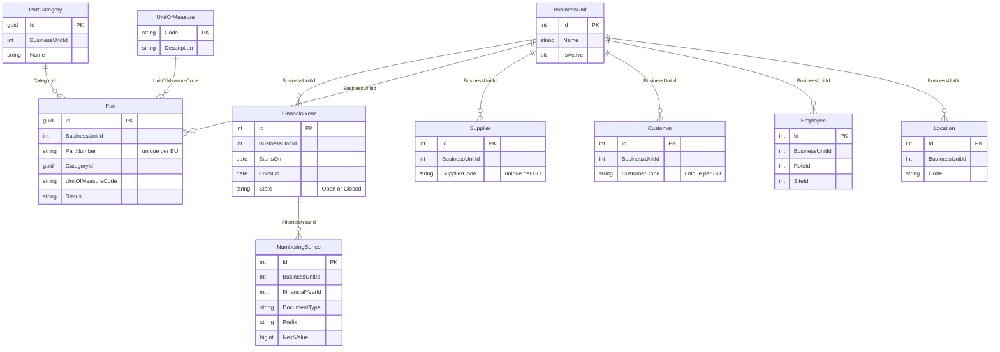
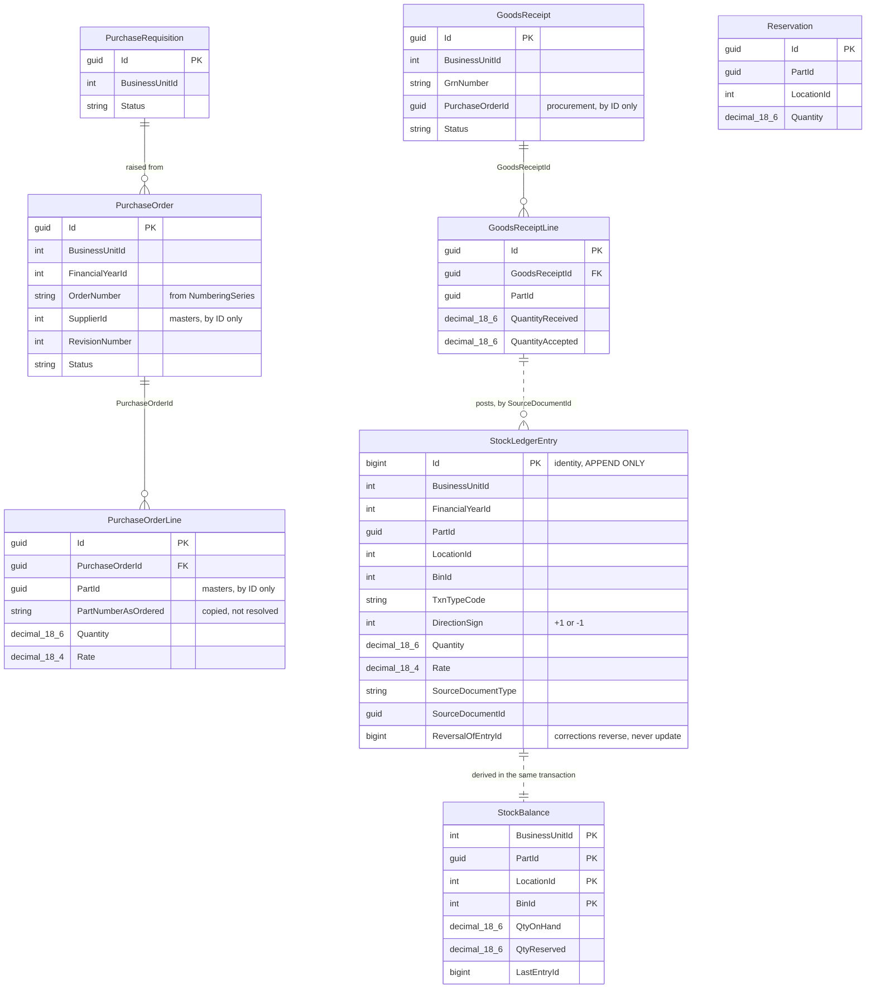
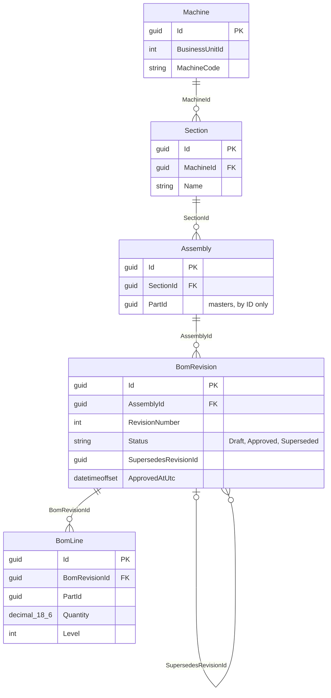

# Data model — where the schema is going

> **This document describes intent, not reality.** Nothing here is evidence that a table
> exists. The only description of what exists is [`db/erd/`](../db/erd), which is generated
> from the EF Core model and cannot disagree with the database.
>
> Read this to decide what to build. Read `db/erd/` to find out what you have.

The split is deliberate. A generator can only ever draw what exists, so it says nothing
about the thirteen modules still ahead; a design document can never be trusted as truth,
because nothing forces it to be right. Neither file can do the other's job, so neither
tries.

**Status markers** used throughout: **[built]** exists today · **[phase N]** planned for
that delivery phase (see `architecture.md` §9) · **[gap]** required by a convention in
`architecture.md` §6 but not yet designed.

---

## 1. Module ownership

One module owns one schema and one `DbContext`. Ownership is exclusive: if two modules
both want to write a table, the table belongs to neither and the boundary is in the wrong
place.

| Module | Schema | Owns | Status |
|---|---|---|---|
| Identity | `identity` | Users, roles, role claims, sessions | **[built]** |
| Masters | `masters` | Part, Supplier, Customer, Employee, BusinessUnit, Role | **[built]** |
| Masters | `masters` | Location, UnitOfMeasure, FinancialYear, NumberingSeries, PartCategory | **[phase 1]** |
| Approvals | `approvals` | ApprovalRequest, ApprovalStep — one engine for all ~10 flows | **[phase 1]** |
| Documents | `documents` | StoredDocument, DocumentLink, drawings | **[phase 1]** |
| Procurement | `procurement` | PurchaseRequisition, Enquiry, Quotation, PurchaseOrder + revisions | **[phase 2]** |
| Inventory | `inventory` | StockLedgerEntry, StockBalance, GoodsReceipt, Reservation, Bin | **[phase 2]** |
| Engineering | `engineering` | Machine → Section → Assembly hierarchy, BomRevision, BomLine | **[phase 3]** |
| Planning | `planning` | Planner runs, SCM projections, stock comparison | phase 4+ |
| Manufacturing | `manufacturing` | WorkOrder, JobCard, MaterialRequisition, Issue | phase 4+ |
| Quality | `quality` | DCR, NCR, Inspection, issue register | phase 4+ |
| Dispatch | `dispatch` | Packaging, Box, Vehicle, dispatch note | phase 4+ |
| Sales | `sales` | Enquiry, Quotation, Service call | phase 4+ |
| Notifications | `notifications` | Outbox, email log, bell notifications | phase 4+ |
| Reporting | — | No tables. Reads via each module's `Integration/` contract | phase 4+ |

Sales Order, invoicing and Finance are **phase 9** and deliberately unplaced. Legacy has
none of them, Sales Order is the biggest missing link, and Finance is expected to integrate
with Tally/Zoho/Busy behind an anti-corruption layer rather than becoming a schema here.

---

## 2. How modules reference each other

**There are no foreign keys between schemas, and there never will be.** Each module owns a
separate `DbContext`, its entities are `internal`, and EF cannot express a constraint across
that boundary. This is the boundary working, not a limitation to engineer around.

So a cross-module reference is **an ID and nothing else**:

1. Store the bare identifier — `PartId`, `SupplierId`. No navigation property, no `Include`.
2. Resolve it through the owning module's `Integration/` contract (`IInventoryApi`,
   `IMastersApi`), never by querying another module's tables.
3. Copy what must not change. A purchase order line records the part number and description
   **as they were when the order was placed**; re-resolving them later would silently rewrite
   history when a master record is edited.
4. React to changes through integration events, not joins.

The cost is real and accepted: no database-level guarantee that a `PartId` on a purchase
order line points at a live part. The alternative — one schema everyone can join across — is
the thing that made the legacy system impossible to change.

The generated diagrams end with a list of columns that name a relationship the database does
not enforce. Cross-module IDs and audit columns will appear in it forever, by design. See
[`db/erd/README.md`](../db/erd/README.md) for which entries are deliberate.

---

## 3. Phase 1 — Identity and Masters

Everything else depends on these, so nothing else can be built until they exist.

**What is missing today.** `PartCategory`, `UnitOfMeasure`, `Location`, `FinancialYear` and
`NumberingSeries` do not exist — `Part.CategoryId` and `Employee.SiteId` already point at
nothing. None of the relationships drawn above are enforced yet: the `masters` schema
currently declares no foreign keys at all.

**Permissions are not in this diagram, and that is correct.** A permission is a compile-time
constant published into the catalogue by the module that defines it, granted per role as an
Identity role claim in `identity.AspNetRoleClaims`. There is no `Permission` table and adding
one would let the two drift. All-access is the `IsSuperAdministrator` flag on the role,
resolved against the catalogue at sign-in, so it cannot fall behind a new module.

`masters.Role` is a legacy-ported grouping master that grants nothing — the roles that carry
permissions are `identity.AspNetRoles`. Two things named "role" is a genuine trap; renaming
the legacy one is worth doing before more code depends on it.

---

## 4. Phase 2 — Procurement, Goods Receipt, Stock Ledger

The highest transaction volume and the riskiest design in the program. The ledger's
invariant is a property-based test written **before** the feature code.

`..` marks a reference the database does not constrain — either across a module boundary or,
as with the ledger, a link carried in a polymorphic `SourceDocumentType`/`SourceDocumentId`
pair that no single foreign key can express.

**The rules that make the ledger safe**, restated from `architecture.md` §4.1 because they
are easy to lose:

- `StockLedgerEntry` is **append-only**. No `UPDATE` grant, no `DELETE` grant. A correction
  is a new reversing entry pointing at `ReversalOfEntryId`.
- `StockBalance` is derived and updated in the **same transaction** as the entry, taking
  `UPDLOCK` on the row.
- The invariant, asserted for any random sequence of postings:
  `SUM(Quantity * DirectionSign)` from the ledger equals `StockBalance.QtyOnHand`. Always.
- Clustered index `(BusinessUnitId, PartId, LocationId, Id)`; columnstore secondary for
  reporting.
- Quantities are `decimal(18,6)`, money is `decimal(18,4)`. `float` and `double` are banned
  symbols, and a mapped floating-point column fails the architecture tests.

---

## 5. Phase 3 — Engineering / BOM

The question this schema must answer, and the legacy one cannot: **which BOM was this
machine actually built to?**

- A `BomRevision` is **immutable once approved**. An amendment creates revision N+1 with a
  computed diff against N. Nothing edits an approved revision in place.
- Cycle detection is a domain invariant with a unit test — an assembly cannot contain itself
  at any depth — not a runtime surprise.
- `BomLine.PartId` crosses into `masters` and is therefore unconstrained, per §2.

---

## 6. Known gaps

Ordered by how much later work they block.

| Gap | Consequence | Where it bites |
|---|---|---|
| **`masters` declares no foreign keys** | Nothing stops an `Employee.RoleId` pointing at a deleted role, or a `Part.CategoryId` at a category that never existed | Every module built on masters. Fix before Phase 2 adds referencing data |
| **`Part.CategoryId`, `Employee.SiteId` point at tables that do not exist** | Columns that look like references and reference nothing | Phase 1 |
| **No `FinancialYear` entity** | No period locking; documents cannot be numbered per year; §6 requires it | Blocks numbering and Phase 2 |
| **No document-numbering sequences** | The duplicate document numbers users notice most in the legacy system. §6 requires a `SEQUENCE` per series per FY and a 200-way concurrency test in CI | Phase 1 |
| **Row-Level Security not applied** | Tenancy rests entirely on the EF query filter. Anything reaching the database outside EF — a report, a script, an ETL run — sees every business unit. §6 calls for RLS as defence in depth | Any non-EF access |
| **Temporal tables not enabled** | `IsTemporal()` is never called. Audit columns record who changed a row last, not what it previously said | Any "what did this look like in March" question |
| **`masters.Role` versus `identity.AspNetRoles`** | Two entities named "role", one of which grants nothing | Rename before more code depends on it |
| **`Employee.Password`** | A password column on a master record, next to a real Identity store that already handles credentials | Decide whether it survives the legacy import |
| **Money precision is inconsistent** | Salary columns on `Employee` are `decimal(18,2)` while §6 specifies `decimal(18,4)` for money. Deliberate or drift, it should be one or the other and written down | Phase 4+ payroll |

---

## 7. Keeping this document honest

It goes stale — that is a property of any hand-written model, and the reason the generated
diagrams exist beside it. Two habits keep the damage small:

- When a phase lands, delete its section from here. The generated diagram becomes the
  description, and the ownership map keeps the one-line entry.
- Do not add detail below the level of keys and shape. Column lists belong in `db/erd/`,
  where they are generated and therefore correct.
